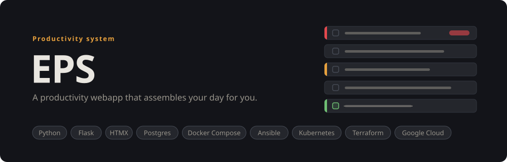
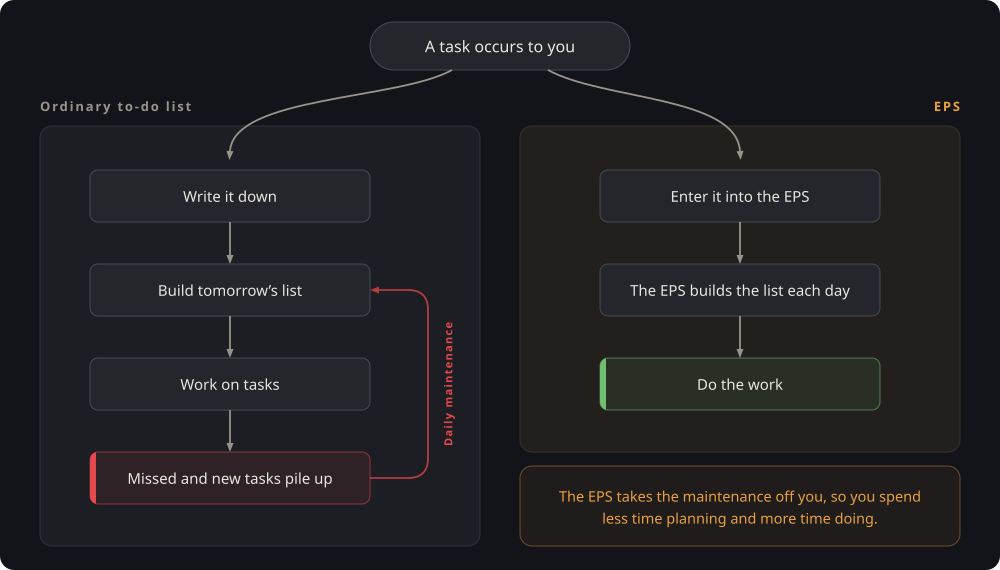
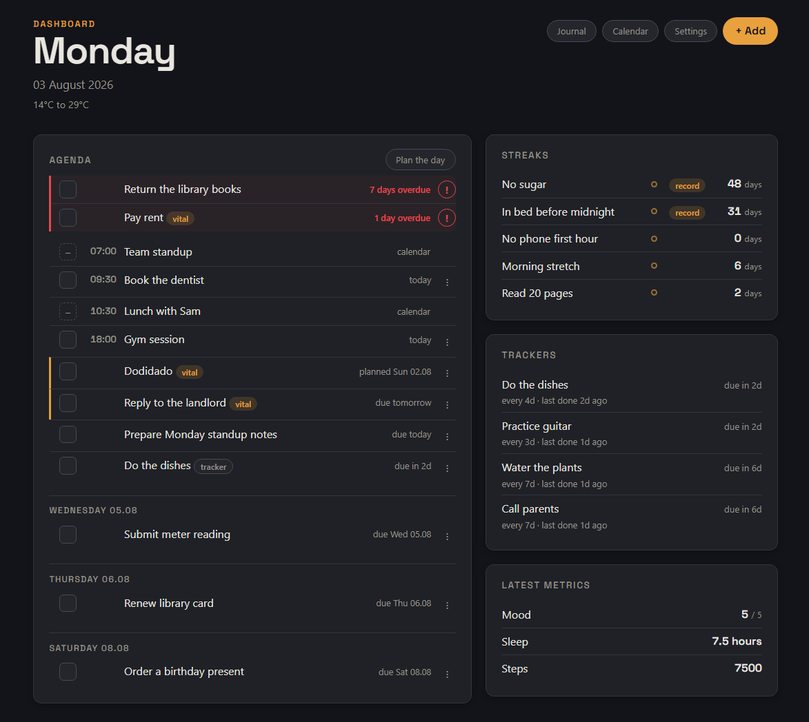
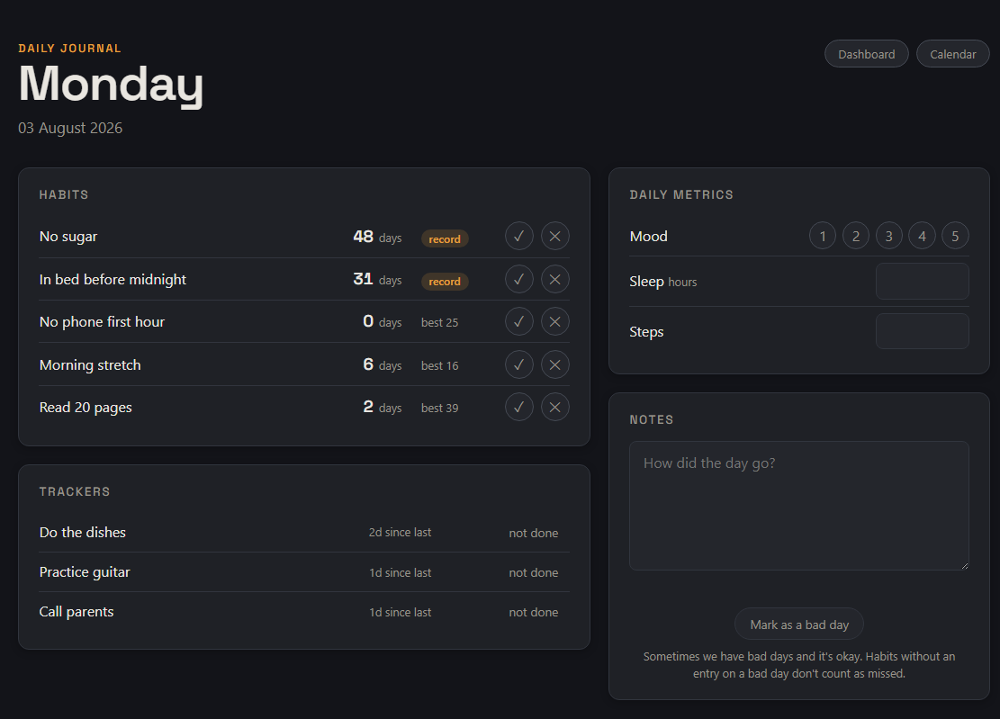
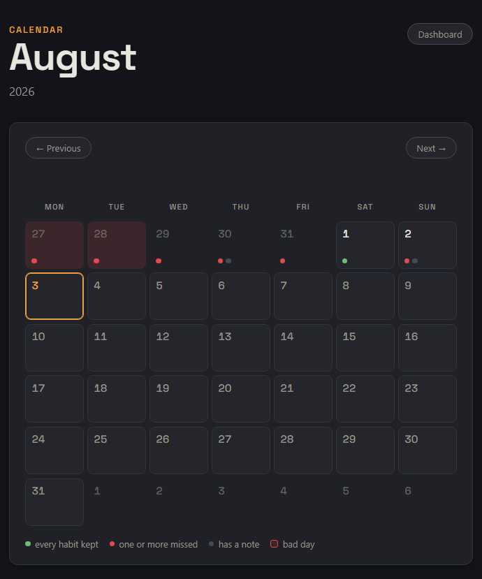
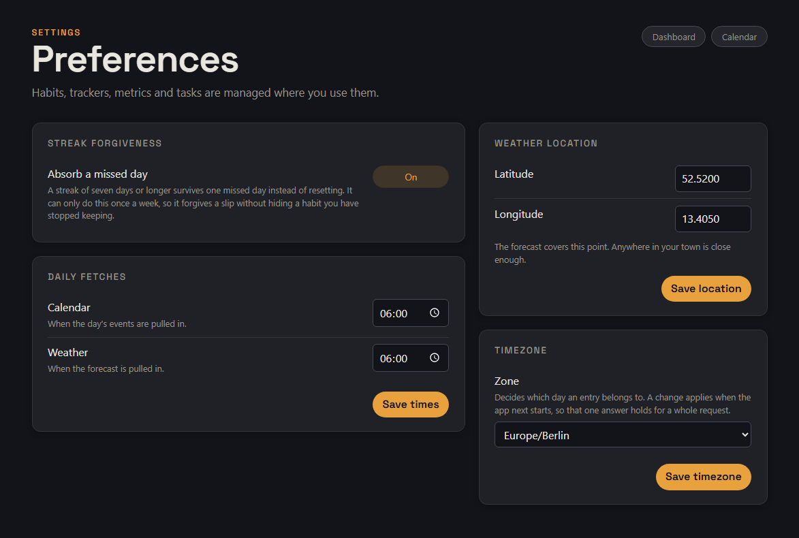
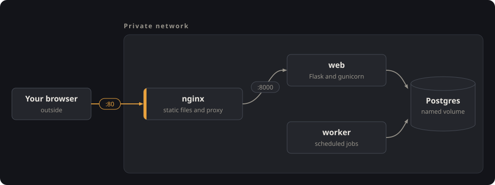
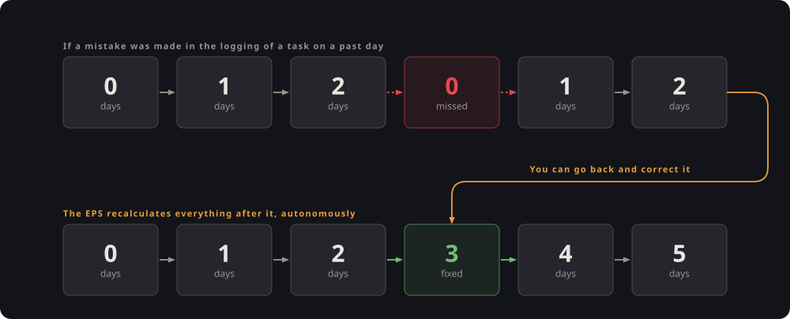
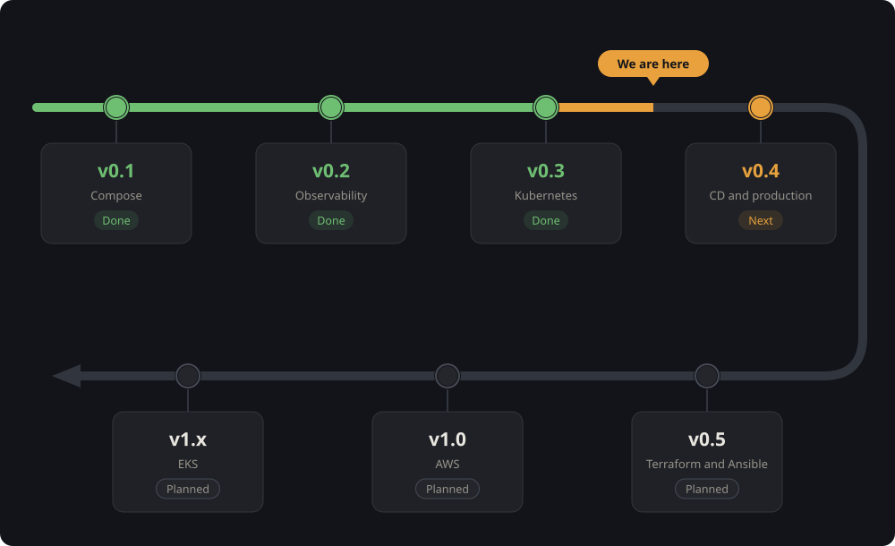

<a id="top"></a>

<p align="center">
  
</p>

<p align="center">
  <a href="https://www.repostatus.org/#wip"></a>
  <a href="LICENSE"></a>
</p>

**Version [v0.1.0](https://github.com/omniops-mm/eps-cloud/releases/tag/v0.1.0) has been released.** Cloning the repository, copying the environment file and running `docker compose up` is enough to build the images and serve the application. Version 0.2 adds the observability layer: Prometheus and Grafana watching the running stack.

### Quick links

[Why this exists](#why-this-exists) · [How it works](#how-it-works) · [What the EPS tracks](#what-the-eps-tracks) · [Architecture](#architecture) · [The data model](#the-data-model) · [Roadmap](#roadmap) · [Running the application](#running-the-application)

---

## Why this exists

I have gone through an insane amount of productivity applications, systems and methods in my attempts to increase the amount of work I could get done. Some succeeded further than others, but they all shared the same fly in the ointment. The systems themselves require daily maintenance work in order to function.

That maintenance is the central problem. An ordinary to-do list requires you to build the following day's list yourself, and that task returns every single day. If it is skipped even once, the resulting backlog becomes a separate task in its own right. The burden grows the longer you use the system, which is what led to the eventual abandonment of each system.

<p align="center">
  
</p>

The EPS moves that work into the software. A task is entered once, together with whatever dates it carries, and the system assembles each day on its own. The effort you spend goes into deciding what matters rather than into sorting. Streaks, recurring tasks, one-off tasks and daily metrics are configured once and are handled from that point onwards.

The current version of this system runs on Claude Cowork by Anthropic; I am essentially using an AI to organise my days. It works, but most of it is mechanical work that can be implemented programmatically. This project is that implementation.

This repository is above all a learning project. I am using it as practice for a career in DevOps and cloud engineering, which is why the version roadmap below is built the way it is. Each step focuses more on adding layers of infrastructure rather than shipping features.

<div align="right"><a href="#top">back to top</a></div>

---

## How it works

The EPS is intended to serve a single user and is rendered entirely on the server. The pages described below make up the user interface as of the current version.

### Dashboard

The dashboard is the main user interface provided to the user. It presents the current day as a single ordered list. Anything overdue comes first, followed by the day's calendar events, its tasks, and any recurring task that has become due. Completed items move to the bottom of the list and are struck through, and the days that follow are listed underneath in their own groups.

A planning mode adds controls for reordering the list into the sequence you intend to work through. Overdue items are tasks that have not been done when they were planned. These float to the top and demand reorganisation from the user so that they may be marked done, deleted or rescheduled. Any task that has gone untouched for more than a week is flagged, and the interface asks whether it is still intended, which prevents the list from accumulating work that will never be done. Entries of every kind are created through a single panel at the top of the page.

<p align="center">
  
</p>

### Journal

The daily journal is what turns the EPS from a glorified to-do list into a daily companion. Within it, streaks are marked, recurring tasks are kept an eye on, metrics important to the user are recorded, and a note about the day is written. This allows for long-term tracking of anything important to the user, and provides the structure needed to improve any aspect of their life, provided they put in the daily effort.

<p align="center">
  
</p>

### Calendar

The calendar is the main way to navigate from day to day, so as to allow the viewing of days in the past and the future. Each cell in the month grid carries small markers indicating whether streaks were kept or missed, whether a note was written, and whether the day was marked as bad. Selecting a day opens it in the state it was in at the time, with a list of its tasks. Past days remain fully editable, so a streak that was not marked three weeks ago can be corrected in two clicks, after which the affected figures are recalculated.

<p align="center">
  
</p>

### Settings

The settings page holds a small number of choices that apply globally: the streak grace mechanic, the location used for the weather forecast, the times at which the daily fetches run, and the timezone. The options and methods for adjusting individual tasks were moved to where they are more convenient, for the sake of usability.

<p align="center">
  
</p>

<div align="right"><a href="#top">back to top</a></div>

---

## What the EPS tracks

### Tasks

Tasks always carry a date, and that is what allows the software to assemble the day rather than leaving the work to you. A task can be scheduled for a particular day, given a deadline by which it has to be completed, or set to recur. A recurring task is one to which the EPS assigns a fresh deadline at a fixed interval, so that a chore due every four days reappears without having to be created again each time. Recurring tasks can additionally be restricted to particular weekdays, which allows a weekend errand to appear only on Saturday and Sunday, for example.

### Streaks

Streaks cover the daily fundamentals, such as going to bed on time, staying off your phone for the first hour of the day, or reading a set number of pages. They are marked once a day, and the count records how long each one has been maintained. Because some of them are difficult to keep perfectly, an optional grace mechanic is available. Once a streak has reached seven days it survives a single missed day rather than resetting, and it can only do so once a week. This forgives an occasional lapse without concealing a habit that has genuinely been abandoned. The mechanic can be disabled entirely in the settings.

### Daily metrics and notes

The journal is intended to take a minute or two before bed, and exists so that days can be compared against one another later. Alongside the written note it records metrics that you define yourself, such as mood, sleep quality, energy, weight or step count. Each metric is either a rating from one to five or a plain number with a unit attached. If the day went badly, marking it as such prevents the streaks left unmarked from being counted as failures.

The weather shown on the dashboard is retrieved from [BrightSky](https://brightsky.dev/), which is free and requires no key. Calendar events are displayed on the dashboard and on past days.

<div align="right"><a href="#top">back to top</a></div>

---

## Architecture

The EPS runs as four containers, each responsible for a single concern.

<p align="center">
  
</p>

- **nginx** is the only container reachable from outside the private network. It serves the static files and passes every other request inward. TLS is introduced in version 0.3, where this container's role passes to the Kubernetes ingress controller.
- **web** is the application itself. It runs Flask under gunicorn and renders every page on the server through Jinja2 templates. HTMX provides the interactive behaviour, which removes the need for a separate frontend application.
- **worker** executes the scheduled jobs in a process of its own rather than inside a web request. It retrieves the weather each morning and trims the audit log each night. Each job can also be invoked individually by name from the command line, which is what an external scheduler would call. No traffic is directed to the worker.
- **Postgres** stores the data and is accessed through SQLAlchemy, with every schema change applied as a versioned Alembic migration. Its files are held on a named volume so that the data outlives the container.

All four containers share a private network, and nginx exposes the only published port.

A fifth service, `migrate`, applies the migrations and then exits. It reuses the web image rather than requiring another one to be built, and neither web nor worker is permitted to start until it has exited successfully. Schema changes are given a dedicated short-lived process because exactly one process should apply them regardless of how many web replicas are running, and because a migration that fails should leave a stack that refuses to start rather than one that starts and then serves errors against an incomplete schema.

<div align="right"><a href="#top">back to top</a></div>

---

## The data model

Every value that the EPS displays is calculated from a permanent record of what has happened, rather than being stored directly as a single authoritative figure.

When a streak is marked, the application appends one row to a log table stating that the streak was kept on that date. The log only ever grows, and none of its rows are overwritten. The count that appears on the dashboard is produced by replaying that log from the beginning, and the result is written into a summary table, which is what the interface actually reads.

<p align="center">
  
</p>

This arrangement is what makes the past editable. Opening a day from three weeks ago and marking a streak that was missed causes the application to do exactly what it always does: append the row, replay the log, and rebuild the summary. Every day following the correction is recalculated on its own. There is no separate mechanism for editing history, and the summary cannot disagree with the log, because it is discarded and recalculated on every change. The same applies to everything else that can be adjusted, so the system remains editable without ever falling out of step with itself.

Every change made to past data is recorded in an audit log, which stores the table, the field, the previous value and the new one, and is retained for 180 days. Nothing in the interface reads it at present. It exists so that editing history is never lossy, and as the basis for presenting that history at a later point.

The application is single-user throughout. Multi-user support is not a concern for version 1, and the settings table carries a constraint that enforces exactly one row.

<div align="right"><a href="#top">back to top</a></div>

---

## Roadmap

Each version adds one substantial piece of infrastructure. The application itself changes very little between them, which is deliberate. The objective is a small application deployed thoroughly rather than a large one deployed poorly.

<p align="center">
  
</p>

<!-- Written as HTML rather than a pipe table so the cells can carry valign="middle".
     Without it the bullet lists sit at the top of each row and leave dead space under them. -->
<table>
<thead>
<tr><th>Version</th><th>What it adds</th><th>Stack</th><th>Status</th></tr>
</thead>
<tbody>
<tr>
<td valign="middle"><b>v0.1</b></td>
<td valign="middle"><ul><li>Four containers on a private network, with healthchecks and a named volume.</li><li>Schema changes applied as versioned migrations from the first commit.</li><li>Every push linted, type checked, tested, built and scanned.</li></ul></td>
<td valign="middle">Docker Compose, Alembic, GitHub Actions, ruff, mypy, pytest, gitleaks, Trivy, GHCR</td>
<td valign="middle"><b>Done</b></td>
</tr>
<tr>
<td valign="middle"><b>v0.2</b></td>
<td valign="middle"><ul><li>Prometheus scraping the application, the worker, the database and the containers.</li><li>Grafana dashboards and alert rules stored in the repository, so a fresh <code>compose up</code> rebuilds them.</li><li>Alert rules covering an unreachable application and scheduled jobs that stop running.</li></ul></td>
<td valign="middle">Prometheus, Grafana, Alertmanager, postgres_exporter, cAdvisor</td>
<td valign="middle"><b>Next</b></td>
</tr>
<tr>
<td valign="middle"><b>v0.3</b></td>
<td valign="middle"><ul><li>The same stack expressed as Kubernetes workloads on a local cluster.</li><li>The worker's jobs turned into CronJobs, network policy between the tiers, and TLS at the ingress.</li><li>A load test used to drive the autoscaler.</li></ul></td>
<td valign="middle">k3d, Helm, NetworkPolicies, probes, HPA, ingress-nginx, cert-manager, k6</td>
<td valign="middle">Planned</td>
</tr>
<tr>
<td valign="middle"><b>v0.4</b></td>
<td valign="middle"><ul><li>A private virtual machine as the production environment, with the local cluster kept for development.</li><li>Pull-based deployment: the cluster pulls its state from git, and CI holds no credentials for it.</li><li>Monitoring and log aggregation moved onto the cluster. Images signed and shipped with a software bill of materials.</li></ul></td>
<td valign="middle">k3s, ArgoCD, kube-prometheus-stack, Loki, cosign, Pod Security Admission</td>
<td valign="middle">Planned</td>
</tr>
<tr>
<td valign="middle"><b>v0.5</b></td>
<td valign="middle"><ul><li>The production machine created by Terraform and configured and hardened by Ansible.</li><li>The machine destroyed and rebuilt from the repository, to prove nothing on it was set up by hand.</li></ul></td>
<td valign="middle">Terraform, Ansible, Ansible Vault</td>
<td valign="middle">Planned</td>
</tr>
<tr>
<td valign="middle"><b>v1.0</b></td>
<td valign="middle"><ul><li>The same design on AWS: a network built by hand rather than taken from the default, with public and private subnets across two availability zones.</li><li>The database moved to a managed service, and a deployment that authenticates without stored credentials.</li><li>Infrastructure brought up for each working session and destroyed at the end of it, with budget alarms from the start.</li></ul></td>
<td valign="middle">Terraform, AWS VPC, EC2, RDS, IAM, S3, DynamoDB, GitHub Actions OIDC, tfsec, Budgets, Infracost</td>
<td valign="middle">Planned</td>
</tr>
<tr>
<td valign="middle"><b>v1.x</b></td>
<td valign="middle"><ul><li>The cluster swapped for managed Kubernetes behind a load balancer.</li><li>Pods with keyless access to AWS, and secrets pulled from a managed store instead of being held in the cluster.</li></ul></td>
<td valign="middle">EKS, ALB, IRSA, External Secrets, Secrets Manager</td>
<td valign="middle">Planned</td>
</tr>
</tbody>
</table>

### Security, Observability, CI/CD

Security, observability and the setting up of CI/CD pipelines are all things that I wanted to implement into this project. They are, however, not things that one builds in a particular version and is then done with. They are fundamental practices that exist throughout the entire development process, and thus need to be applied at every stage.

| Version | CI/CD | Security | Observability |
| --- | --- | --- | --- |
| **v0.1** | lint, type check, test, build, scan, publish by commit SHA | gitleaks, non-root images, pinned bases, Trivy, secrets kept out of git | JSON logs, `/metrics`, `/healthz`, `/readyz` |
| **v0.2** | dashboards and alert rules provisioned from the repository | metrics endpoint hidden at the proxy | Prometheus, Grafana, Alertmanager |
| **v0.3** | charts linted and templated in CI | NetworkPolicies, TLS at the ingress | k6 load test driving the autoscaler |
| **v0.4** | pull-based CD: the cluster syncs itself from git | image signing, SBOM, Pod Security Admission | kube-prometheus-stack, Loki, synthetic probes |
| **v0.5** | the playbook proven idempotent, ansible-lint in CI | host hardening: ssh lockdown, firewall, unattended upgrades, Vault | database backups on a timer, with the restore rehearsed |
| **v1.0** | deploys authenticate through OIDC, no long-lived keys | tfsec, least-privilege IAM | CloudWatch for the AWS pieces |
| **v1.x** | GitOps against EKS | IRSA, External Secrets | the same stack carried onto EKS |

One piece of deliberate sequencing is worth naming: the structured logs and the metrics endpoint went into the application at version 0.1, before anything existed to read them. Telemetry only accumulates from the moment it is emitted, so the application was instrumented first and the dashboards come second.

<div align="right"><a href="#top">back to top</a></div>

---

## Running the application

```bash
git clone https://github.com/omniops-mm/eps-cloud.git
cd eps-cloud
cp .env.example .env      # then fill in the values it asks for
docker compose up
```

The first run builds the images, applies the migrations and serves the dashboard on port 80. The system starts empty.

An example database can be loaded instead, for anyone who would rather see the application with data already in it:

```bash
docker compose run --rm web python seed.py
```

This populates the database with roughly two months of example history. It can be run repeatedly, and its data can be deleted safely.

Removing the application is one command, since nothing is installed outside of Docker:

```bash
docker compose down -v    # stops and removes the containers, the network and the database volume
```

Adding `--rmi all` removes the built images as well, which returns the machine to the state it was in before the clone.

<div align="right"><a href="#top">back to top</a></div>

---

## License

MIT, see [LICENSE](LICENSE).

The Space Grotesk typeface is not covered by that licence. It is bundled in `app/static/fonts/` and embedded in the diagrams under `docs/img/`, and is licensed separately under the SIL Open Font License 1.1. Its copyright notice and licence text are in [app/static/fonts/OFL.txt](app/static/fonts/OFL.txt).

<div align="right"><a href="#top">back to top</a></div>
