<a id="top"></a>

<p align="center">
  
</p>

<p align="center">
  <a href="https://www.repostatus.org/#wip"></a>
  <a href="LICENSE"></a>
</p>

**Version [v0.5.0](https://github.com/omniops-mm/eps-cloud/tree/v0.5.0).** EPS runs on a private Kubernetes deployment on Google Cloud, with GitOps delivery, metrics, logs and traces, and infrastructure configured through Terraform and Ansible. The local Compose stack remains available for development.

### Quick links

[Why this exists](#why-this-exists) · [How it works](#how-it-works) · [What the EPS tracks](#what-the-eps-tracks) · [Architecture](#architecture) · [The data model](#the-data-model) · [Kubernetes](#kubernetes) · [Observability](#observability) · [CI/CD and GitOps](#cicd-and-gitops) · [Security](#security) · [Cloud infrastructure](#cloud-infrastructure) · [Running the application](#running-the-application) · [Roadmap](#roadmap)

---

## Why this exists

I have gone through an insane amount of productivity applications, systems and methods in my attempts to increase the amount of work I could get done. Some succeeded further than others, but they all shared the same fly in the ointment. The systems themselves require daily maintenance work in order to function.

That maintenance is the central problem. An ordinary to-do list requires you to build the following day's list yourself, and that task returns every single day. If it is skipped even once, the resulting backlog becomes a separate task in its own right. The burden grows the longer you use the system, which is what led to the eventual abandonment of each system.

<p align="center">
  
</p>

The EPS moves that work into the software. A task is entered once, together with whatever dates it carries, and the system assembles each day on its own. The effort you spend goes into deciding what matters rather than into sorting. Streaks, recurring tasks, one-off tasks and daily metrics are configured once and are handled from that point onwards.

The current version of this system runs on Claude Cowork by Anthropic; I am essentially using an AI to organise my days. It works, but most of it is mechanical work that can be implemented programmatically. This project is that implementation.

This repository is above all a learning project. I am using it as practice for a career in DevOps and cloud engineering, which is why the version roadmap below is built the way it is. Each step focuses more on adding layers of infrastructure rather than shipping features.

<div align="right"><a href="#top">back to top</a></div>

---

## How it works

The EPS is intended to serve a single user and is rendered entirely on the server. The pages described below make up the user interface as of the current version.

### Dashboard

The dashboard is the main user interface provided to the user. It presents the current day as a single ordered list. Anything overdue comes first, followed by the day's calendar events, its tasks, and any recurring task that has become due. Completed items move to the bottom of the list and are struck through, and the days that follow are listed underneath in their own groups.

A planning mode adds controls for reordering the list into the sequence you intend to work through. Overdue items are tasks that have not been done when they were planned. These float to the top and demand reorganisation from the user so that they may be marked done, deleted or rescheduled. Any task that has gone untouched for more than a week is flagged, and the interface asks whether it is still intended, which prevents the list from accumulating work that will never be done. Entries of every kind are created through a single panel at the top of the page.

<p align="center">
  
</p>

### Journal

The daily journal is what turns the EPS from a glorified to-do list into a daily companion. Within it, streaks are marked, recurring tasks are kept an eye on, metrics important to the user are recorded, and a note about the day is written. This allows for long-term tracking of anything important to the user, and provides the structure needed to improve any aspect of their life, provided they put in the daily effort.

<p align="center">
  
</p>

### Calendar

The calendar is the main way to navigate from day to day, so as to allow the viewing of days in the past and the future. Each cell in the month grid carries small markers indicating whether streaks were kept or missed, whether a note was written, and whether the day was marked as bad. Selecting a day opens it in the state it was in at the time, with a list of its tasks. Past days remain fully editable, so a streak that was not marked three weeks ago can be corrected in two clicks, after which the affected figures are recalculated.

<p align="center">
  
</p>

### Settings

The settings page holds a small number of choices that apply globally: the streak grace mechanic, the location used for the weather forecast, the times at which the daily fetches run, and the timezone. The options and methods for adjusting individual tasks were moved to where they are more convenient, for the sake of usability.

<p align="center">
  
</p>

<div align="right"><a href="#top">back to top</a></div>

---

## What the EPS tracks

### Tasks

Tasks always carry a date, and that is what allows the software to assemble the day rather than leaving the work to you. A task can be scheduled for a particular day, given a deadline by which it has to be completed, or set to recur. A recurring task is one to which the EPS assigns a fresh deadline at a fixed interval, so that a chore due every four days reappears without having to be created again each time. Recurring tasks can additionally be restricted to particular weekdays, which allows a weekend errand to appear only on Saturday and Sunday, for example.

### Streaks

Streaks cover the daily fundamentals, such as going to bed on time, staying off your phone for the first hour of the day, or reading a set number of pages. They are marked once a day, and the count records how long each one has been maintained. Because some of them are difficult to keep perfectly, an optional grace mechanic is available. Once a streak has reached seven days it survives a single missed day rather than resetting, and it can only do so once a week. This forgives an occasional lapse without concealing a habit that has genuinely been abandoned. The mechanic can be disabled entirely in the settings.

### Daily metrics and notes

The journal is intended to take a minute or two before bed, and exists so that days can be compared against one another later. Alongside the written note it records metrics that you define yourself, such as mood, sleep quality, energy, weight or step count. Each metric is either a rating from one to five or a plain number with a unit attached. If the day went badly, marking it as such prevents the streaks left unmarked from being counted as failures.

The weather shown on the dashboard is retrieved from [BrightSky](https://brightsky.dev/), which is free and requires no key. Calendar events are displayed on the dashboard and on past days.

<div align="right"><a href="#top">back to top</a></div>

---

## Architecture

The diagram below shows the local Compose deployment and the application's four main components. On Kubernetes, Traefik handles incoming HTTP traffic and CronJobs schedule the worker commands; the application and database responsibilities stay the same.

The application runs as four containers, each responsible for a single concern. Version 0.2 added the monitoring services alongside them, which are described under [Observability](#observability); this section covers the application itself.

<p align="center">
  
</p>

- **nginx** accepts browser requests through a loopback port on the host. It serves static files and forwards application requests to web. On Kubernetes, the ingress controller routes requests and terminates TLS.
- **web** is the application itself. It runs Flask under gunicorn and renders every page on the server through Jinja2 templates. HTMX provides the interactive behaviour, which removes the need for a separate frontend application.
- **worker** executes the scheduled jobs in a process of its own rather than inside a web request. It retrieves the weather each morning and trims the audit log each night. Each job can also be invoked individually by name from the command line, which is what an external scheduler would call. No traffic is directed to the worker.
- **Postgres** stores the data and is accessed through SQLAlchemy, with every schema change applied as a versioned Alembic migration. Its files are held on a named volume so that the data outlives the container.

The containers share a private network. Published application, database and monitoring ports bind to the local machine for development.

A fifth service, `migrate`, applies the migrations and then exits. It reuses the web image rather than requiring another one to be built, and neither web nor worker is permitted to start until it has exited successfully. Schema changes are given a dedicated short-lived process because exactly one process should apply them regardless of how many web replicas are running, and because a migration that fails should leave a stack that refuses to start rather than one that starts and then serves errors against an incomplete schema.

<div align="right"><a href="#top">back to top</a></div>

---

## The data model

Every value that the EPS displays is calculated from a permanent record of what has happened, rather than being stored directly as a single authoritative figure.

When a streak is marked, the application appends one row to a log table stating that the streak was kept on that date. The log only ever grows, and none of its rows are overwritten. The count that appears on the dashboard is produced by replaying that log from the beginning, and the result is written into a summary table, which is what the interface actually reads.

<p align="center">
  
</p>

This arrangement is what makes the past editable. Opening a day from three weeks ago and marking a streak that was missed causes the application to do exactly what it always does: append the row, replay the log, and rebuild the summary. Every day following the correction is recalculated on its own. There is no separate mechanism for editing history, and the summary cannot disagree with the log, because it is discarded and recalculated on every change. The same applies to everything else that can be adjusted, so the system remains editable without ever falling out of step with itself.

Every change made to past data is recorded in an audit log, which stores the table, the field, the previous value and the new one, and is retained for 180 days. Nothing in the interface reads it at present. It exists so that editing history is never lossy, and as the basis for presenting that history at a later point.

The application is single-user throughout. Multi-user support is not a concern for version 1, and the settings table carries a constraint that enforces exactly one row.

<div align="right"><a href="#top">back to top</a></div>

---

## Kubernetes

EPS runs on k3s with a Helm chart for the application workloads. Argo CD deploys the chart from Git. Local development uses k3d with the same chart and separate ingress, image and storage settings.

<p align="center">
  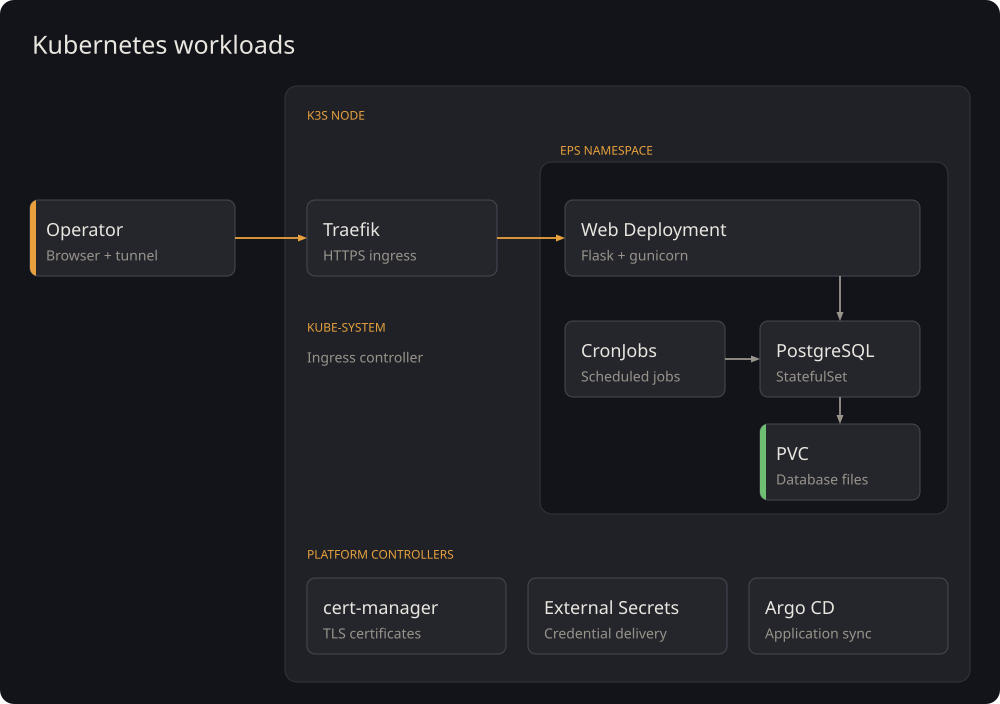
</p>

### Workloads and traffic

The web Deployment runs Flask and gunicorn behind a ClusterIP Service. Traefik terminates HTTPS and forwards requests to ready web pods. The readiness probe checks `/readyz`, including the database connection. Pods that are still starting or cannot reach the database are removed from Service endpoints. The liveness probe checks `/healthz` and restarts unresponsive containers.

PostgreSQL runs as a StatefulSet with a persistent volume claim on the node's retained disk. Replacing a database pod preserves its files. CronJobs run the weather refresh and audit-log cleanup tasks. Their schedules and timezone are chart settings; Compose uses a long-running scheduler for these tasks.

GitOps deployments run a migration Job before updating the web Deployment and autoscaler. A failed migration stops that sync before the web rollout. Direct Helm installations can run migrations in an init container. Both paths use a database advisory lock to serialize migrations.

### Autoscaling

HPA scales the web Deployment from CPU usage. The chart also supports request-rate scaling: Prometheus records requests per pod, Prometheus Adapter exposes that rate through the custom metrics API, and HPA compares it with the configured target. Replica bounds and stabilization windows control how far and how quickly the Deployment scales.

The [Helm chart](deploy/helm/eps) contains the workload definitions. [Deployment instructions](deploy/README.md) cover local and cloud settings.

<div align="right"><a href="#top">back to top</a></div>

---

## Observability

Prometheus stores metrics, Loki stores logs, and Tempo stores traces. Grafana queries all three and links request measurements to their logs and spans.

<p align="center">
  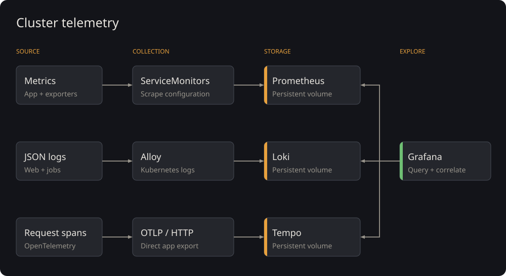
</p>

### Metrics and dashboards

The application exposes request counters and duration histograms at `/metrics`. Labels use route templates, methods and status codes. User-supplied dates and path values do not create new time series. ServiceMonitor resources select the endpoints Prometheus scrapes.

The PostgreSQL exporter reports database metrics, kube-state-metrics reports workload state, and the blackbox exporter probes the private HTTPS readiness endpoint. The RED dashboard displays request rate, errors and latency. Separate dashboards display resource use, database activity and CronJob status. CronJob completion metrics come from Kubernetes state and remain available after job pods exit.

Dashboard JSON, datasource settings and alert rules are stored in Git. Ansible installs the monitoring stack and dashboard ConfigMap. The application chart installs its scrape targets and alert rules.

### Logs and traces

Web and job containers emit structured JSON logs. Alloy reads selected pod logs through the Kubernetes API and adds namespace, pod, container and application labels before forwarding them to Loki.

OpenTelemetry instruments Flask requests and SQLAlchemy operations. The application batches spans and exports them directly to Tempo over OTLP/HTTP. Request logs include a trace ID. Sampled request metrics include an exemplar linked to that trace.

<p align="center">
  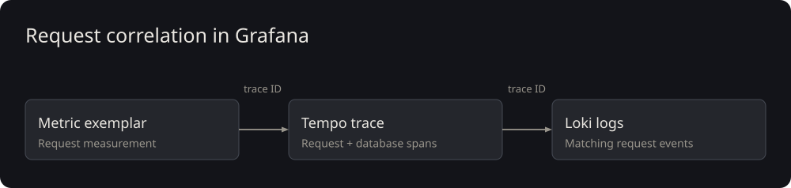
</p>

Grafana uses the trace ID to open a trace from a log or metric exemplar. Trace-to-log queries retrieve events around the selected span. This connects a slow request with its database operations and application logs.

### Alerts

Prometheus rules detect unavailable web targets, sustained HTTP errors, stale jobs and missing CronJobs. Alertmanager groups notifications and sends firing and resolved updates to an internal webhook receiver. The receiver records each delivery in its log.

<p align="center">
  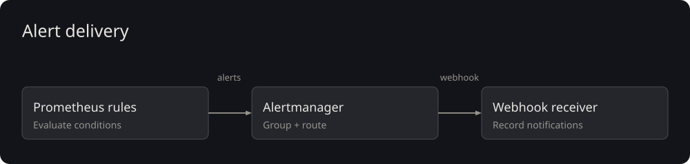
</p>

### Storage

Prometheus, Loki and Tempo use persistent volumes on the retained node disk. Their Helm values set storage limits and retention periods. Grafana has its own persistent volume for application state, while datasource and dashboard definitions are provisioned from Git.

Configuration is in [deploy/platform](deploy/platform) and [the dashboard directory](deploy/helm/eps/dashboards). The [Compose monitoring stack](observability) supports local development.

<div align="right"><a href="#top">back to top</a></div>

---

## CI/CD and GitOps

The repository has two branches with separate roles. `master` contains application code, tests and infrastructure configuration. `production` contains the deployment chart and release metadata, with application images pinned by digest. GitHub Actions builds the release artifacts. Argo CD reads the deployment branch and synchronizes the application on Kubernetes.

<p align="center">
  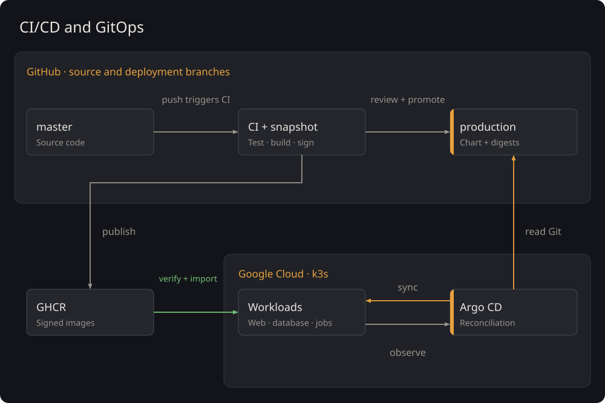
</p>

### Continuous integration

Local pre-commit hooks run gitleaks and Ruff. GitHub Actions runs linting, formatting, type checks and unit tests. PostgreSQL migration tests apply the schema, compare it with the models, and exercise downgrade, seed and migration-lock behavior.

Deployment checks validate the Helm chart and rendered manifests, monitoring rules, Terraform and Ansible. Image jobs run after these checks pass. CI builds and scans each image, publishes it to GHCR, then signs and verifies its digest. The workflow packages the chart and exact image references into a release snapshot.

### Release promotion

The operator reviews the snapshot and deployment diff, then commits the approved snapshot to `production`. Release metadata identifies the source revision and CI run. The application chart references immutable image digests, so the selected images do not change when a registry tag moves.

The cloud setup imports verified images into the node. This image-transfer step is separate from Argo's application synchronization. The CI runner publishes artifacts without cluster administrator credentials.

### GitOps reconciliation

Argo CD renders `production:chart/` and compares it with resources read from the Kubernetes API. A difference marks the application out of sync. An operator starts synchronization; Argo applies the migration Job, web Deployment and remaining resources in their configured order, then reports resource health.

Argo's AppProject restricts the destination namespace and permitted resource types. Ansible manages platform controllers and secret delivery separately. HPA manages the web replica count, and Argo ignores that field when checking for drift.

The implementation is in [ci.yml](.github/workflows/ci.yml). The [deployment guide](deploy/README.md) covers snapshot promotion and Argo configuration.

<div align="right"><a href="#top">back to top</a></div>

---

## Security

### Source and build artifacts

Gitleaks checks for credentials before commit. CI scans built images with Trivy and blocks publication on fixable HIGH or CRITICAL findings. The workflow retains vulnerability reports and software inventories. Cosign signs published digests using the workflow's identity, and verification checks the expected repository and workflow before images are imported.

Private inventories, Terraform state, secret payloads and access files stay outside the repository. Terraform creates Secret Manager containers and IAM grants; secret versions are supplied separately to keep their values out of Terraform state.

### Deployment permissions

Release promotion and cluster synchronization are separate operator actions. Argo can deploy the allowed application resource types into the EPS namespace. Its AppProject excludes Secret and RBAC management, which prevents the application chart from changing those permissions through Argo.

Application pods run as non-root users with restricted security contexts. Workloads use scoped service accounts and RBAC. NetworkPolicies select permitted sources and destinations for database access, ingress and telemetry.

<p align="center">
  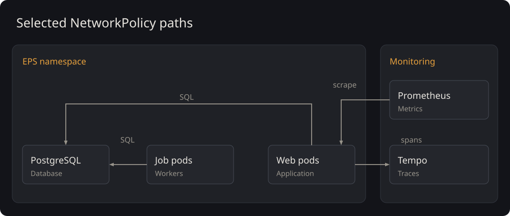
</p>

The chart defines these application traffic rules. Platform policies permit the required DNS, controller and monitoring traffic and restrict access to the cloud metadata service. The diagram shows selected connections; the manifests define the complete rule set.

### Host and ingress

The VPC firewall permits inbound SSH through IAP. IAM and OS Login authenticate the operator, and the SSH configuration disables password and root login. Ansible verifies the pinned k3s binary before installation. The host uses Shielded VM protections and a service account with no direct project role grants.

Application and monitoring Services remain internal to the cluster. IAP and network access controls protect the single-user application. Traefik terminates HTTPS using a private certificate from cert-manager. Access uses a loopback-bound tunnel with CA and hostname verification. The pinned runtime and its update conditions are documented in the [runtime gate](docs/lab-security.md).

### Workload credentials

External Secrets uses workload identity federation to exchange a Kubernetes service-account token for Google access. Federation checks the issuer, audience and service-account identity. IAM grants read access per secret, and namespace-scoped controllers write the corresponding Kubernetes Secrets.

<p align="center">
  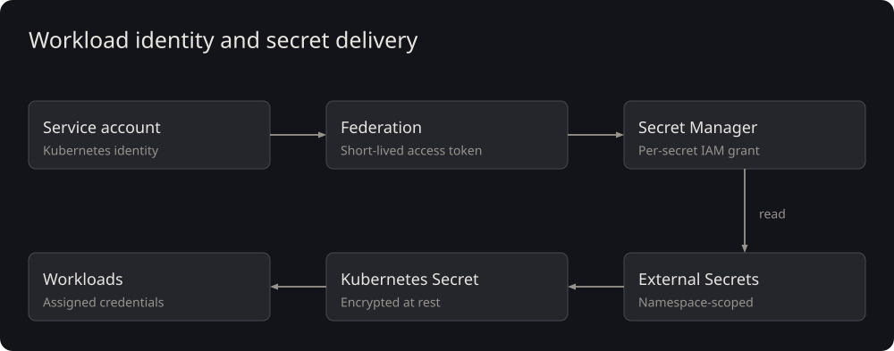
</p>

k3s encrypts Secrets at rest. The rotation procedure updates the external values, refreshes workload credentials, and checks that the previous database password and signed session are rejected. Imported images keep registry credentials out of application pods.

### Telemetry

Log processing redacts credential fields before export. Request records use bounded metadata, and tracing excludes sensitive request fields. Prometheus labels use route templates to limit cardinality and avoid storing user-supplied path values. Collection is limited to selected workloads, and the telemetry stores use internal Services.

<div align="right"><a href="#top">back to top</a></div>

---

## Cloud infrastructure

Terraform provisions the cloud resources. Ansible configures the host and Kubernetes platform. Argo CD deploys the application.

<p align="center">
  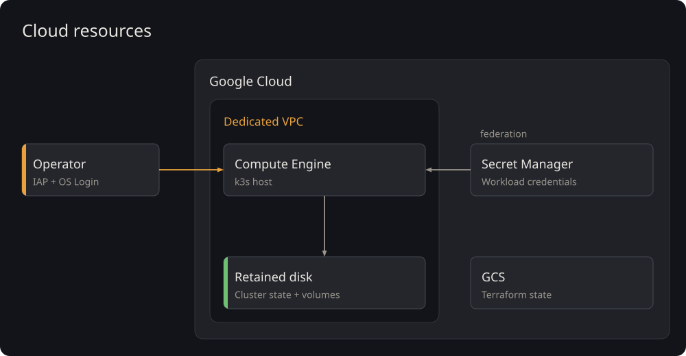
</p>

### Compute, storage and access

The k3s host runs inside a dedicated VPC. Its retained disk stores cluster state and local-path volumes for PostgreSQL and telemetry. Stopping the host preserves that data. An authenticated IAP tunnel provides operator access; the external address supports outbound downloads under the firewall's egress rules.

Secret Manager stores workload credentials. A private GCS backend stores Terraform state separately from the host. Ansible installs a shutdown timer to limit the duration of attended sessions.

### Terraform, Ansible and idempotence

Terraform compares the declared resources with remote state and the provider's current values, then produces a plan. Ansible configures packages, SSH, k3s, image imports and platform charts on the provisioned host. Each tool manages a separate part of the deployment.

<p align="center">
  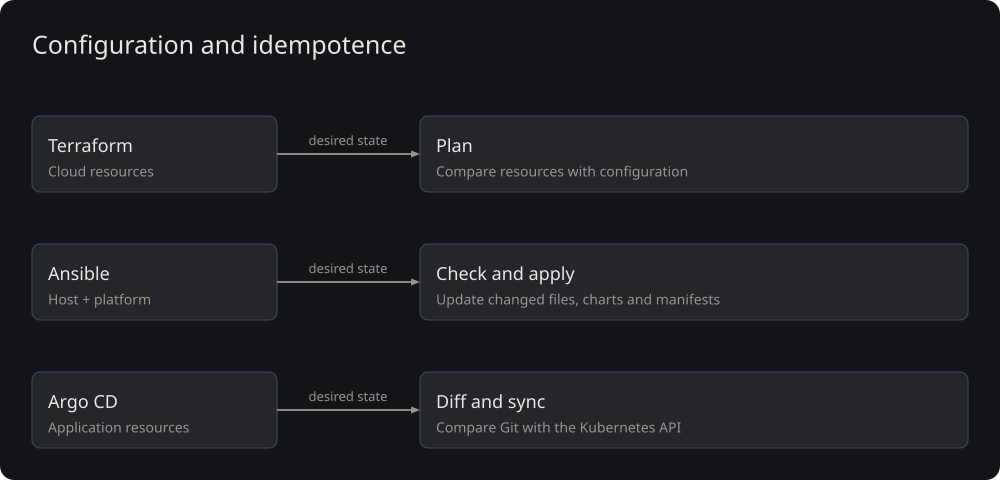
</p>

Repeated runs with unchanged inputs should leave the configuration unchanged. The Ansible platform role checks image archive hashes, installed chart versions and values, and server-side manifest differences. It skips matching resources and upgrades charts only when their inputs change. Argo compares application resources with the deployment branch and applies differences during sync.

The [infrastructure guide](infra/README.md) covers provisioning and configuration. Private inventory and federation inputs stay outside the repository.

### Database recovery

The operator exports PostgreSQL to an off-VM archive and records its checksum. A restore into an isolated namespace and volume checks the schema, table counts and row checksums against the source. Credential and cache table schemas are included; their payloads are excluded.

<p align="center">
  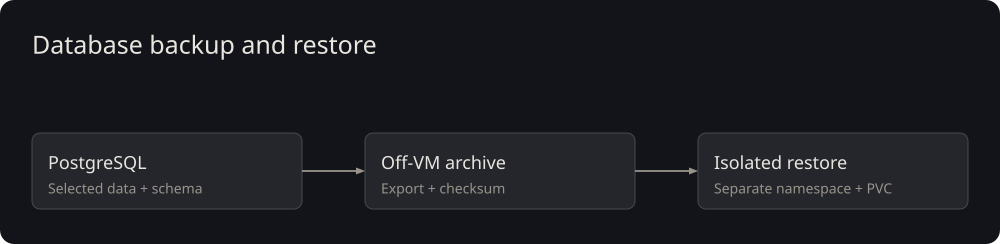
</p>

The retained disk preserves database and telemetry files across host restarts. After maintenance, catch-up Jobs can run the scheduled tasks before their next CronJob interval.

<div align="right"><a href="#top">back to top</a></div>

---


## Running the application

The Compose deployment provides the local application and its monitoring stack:

```powershell
git clone https://github.com/omniops-mm/eps-cloud.git
cd eps-cloud
Copy-Item .env.example .env
# Fill in the values in .env, then start the stack.
docker compose up
```

The first run builds the images, applies migrations and serves the dashboard on port 80. The database starts empty. To load roughly two months of example history:

```powershell
docker compose run --rm web python seed.py
```

To stop the local stack while retaining its database volume:

```powershell
docker compose down
```

For Kubernetes, follow [the deployment guide](deploy/README.md). Cloud provisioning and configuration are described in [the infrastructure guide](infra/README.md), including the runtime gate and the private inputs required for the lab.

<div align="right"><a href="#top">back to top</a></div>

---

## License

MIT, see [LICENSE](LICENSE).

The Space Grotesk typeface is not covered by that licence. It is bundled in `app/static/fonts/` and embedded in the diagrams under `docs/img/`, and is licensed separately under the SIL Open Font License 1.1. Its copyright notice and licence text are in [app/static/fonts/OFL.txt](app/static/fonts/OFL.txt).

<div align="right"><a href="#top">back to top</a></div>

---

## Roadmap

The next versions add managed database, networking and Kubernetes services.

<p align="center">
  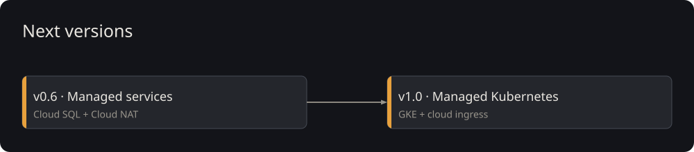
</p>

| Version | Direction | Main additions |
| --- | --- | --- |
| v0.6 | Managed cloud services | Cloud SQL, Cloud NAT and cost review for managed resources. |
| v1.0 | Managed Kubernetes | GKE, cloud ingress and integration with GKE workload identities. |

<div align="right"><a href="#top">back to top</a></div>
