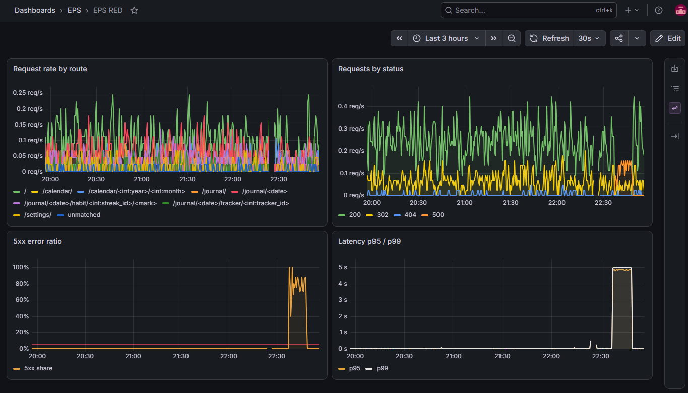
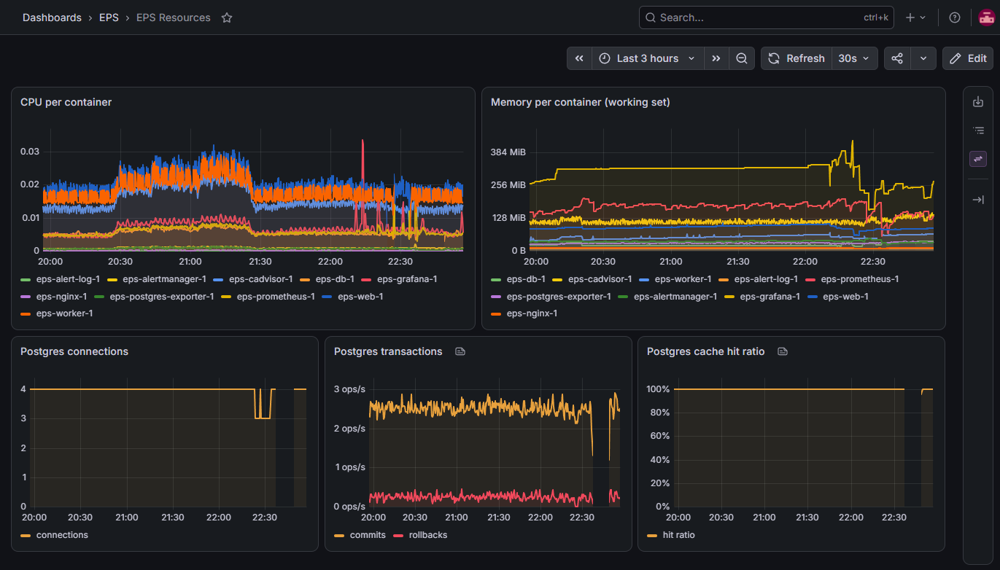
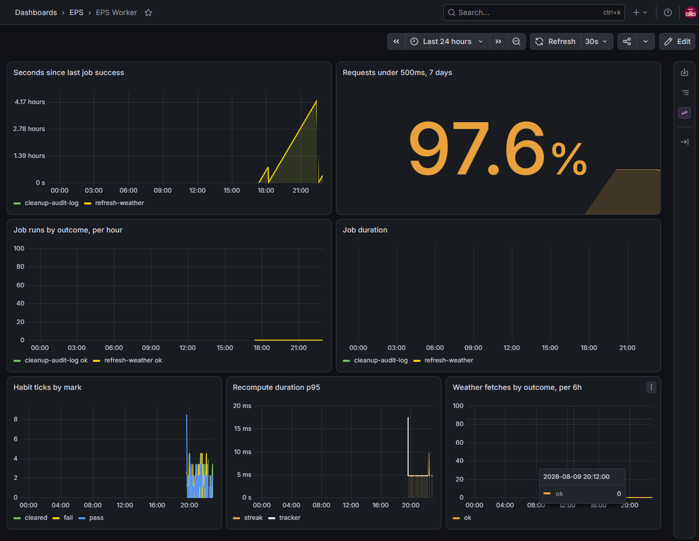
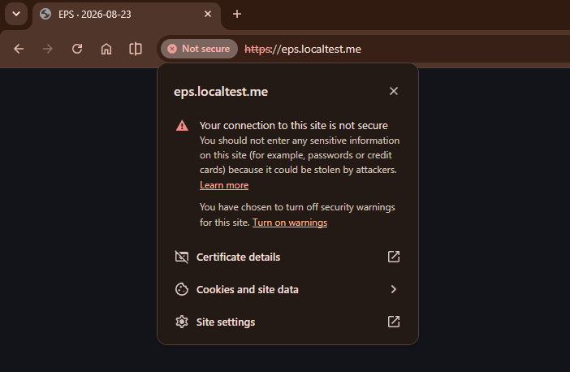
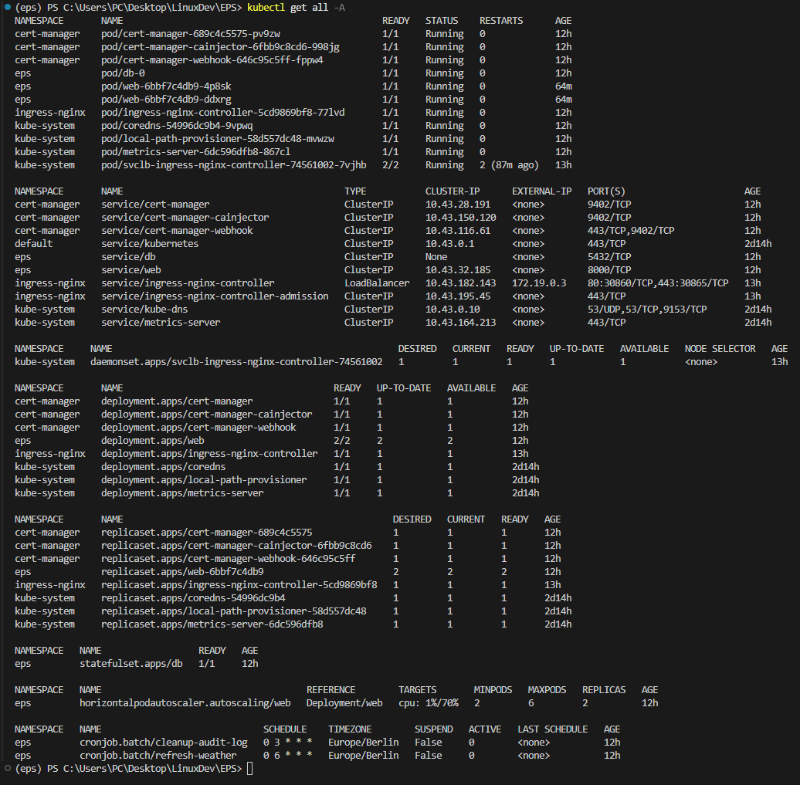

<a id="top"></a>

<p align="center">
  
</p>

<p align="center">
  <a href="https://www.repostatus.org/#wip"></a>
  <a href="LICENSE"></a>
</p>

**Version [v0.3.0](https://github.com/omniops-mm/eps-cloud/releases/tag/v0.3.0) has been released.** The application runs on a local Kubernetes cluster, created from a committed configuration and installed as a Helm chart, with TLS at the ingress, network policy between the tiers and autoscaling on the web tier. The Compose stack from the earlier versions is unchanged. Version 0.4 adds a production machine and pull-based deployment.

### Quick links

[Why this exists](#why-this-exists) · [How it works](#how-it-works) · [What the EPS tracks](#what-the-eps-tracks) · [Architecture](#architecture) · [The data model](#the-data-model) · [Observability](#observability) · [Kubernetes](#kubernetes) · [Roadmap](#roadmap) · [Running the application](#running-the-application)

---

## Why this exists

I have gone through an insane amount of productivity applications, systems and methods in my attempts to increase the amount of work I could get done. Some succeeded further than others, but they all shared the same fly in the ointment. The systems themselves require daily maintenance work in order to function.

That maintenance is the central problem. An ordinary to-do list requires you to build the following day's list yourself, and that task returns every single day. If it is skipped even once, the resulting backlog becomes a separate task in its own right. The burden grows the longer you use the system, which is what led to the eventual abandonment of each system.

<p align="center">
  
</p>

The EPS moves that work into the software. A task is entered once, together with whatever dates it carries, and the system assembles each day on its own. The effort you spend goes into deciding what matters rather than into sorting. Streaks, recurring tasks, one-off tasks and daily metrics are configured once and are handled from that point onwards.

The current version of this system runs on Claude Cowork by Anthropic; I am essentially using an AI to organise my days. It works, but most of it is mechanical work that can be implemented programmatically. This project is that implementation.

This repository is above all a learning project. I am using it as practice for a career in DevOps and cloud engineering, which is why the version roadmap below is built the way it is. Each step focuses more on adding layers of infrastructure rather than shipping features.

<div align="right"><a href="#top">back to top</a></div>

---

## How it works

The EPS is intended to serve a single user and is rendered entirely on the server. The pages described below make up the user interface as of the current version.

### Dashboard

The dashboard is the main user interface provided to the user. It presents the current day as a single ordered list. Anything overdue comes first, followed by the day's calendar events, its tasks, and any recurring task that has become due. Completed items move to the bottom of the list and are struck through, and the days that follow are listed underneath in their own groups.

A planning mode adds controls for reordering the list into the sequence you intend to work through. Overdue items are tasks that have not been done when they were planned. These float to the top and demand reorganisation from the user so that they may be marked done, deleted or rescheduled. Any task that has gone untouched for more than a week is flagged, and the interface asks whether it is still intended, which prevents the list from accumulating work that will never be done. Entries of every kind are created through a single panel at the top of the page.

<p align="center">
  
</p>

### Journal

The daily journal is what turns the EPS from a glorified to-do list into a daily companion. Within it, streaks are marked, recurring tasks are kept an eye on, metrics important to the user are recorded, and a note about the day is written. This allows for long-term tracking of anything important to the user, and provides the structure needed to improve any aspect of their life, provided they put in the daily effort.

<p align="center">
  
</p>

### Calendar

The calendar is the main way to navigate from day to day, so as to allow the viewing of days in the past and the future. Each cell in the month grid carries small markers indicating whether streaks were kept or missed, whether a note was written, and whether the day was marked as bad. Selecting a day opens it in the state it was in at the time, with a list of its tasks. Past days remain fully editable, so a streak that was not marked three weeks ago can be corrected in two clicks, after which the affected figures are recalculated.

<p align="center">
  
</p>

### Settings

The settings page holds a small number of choices that apply globally: the streak grace mechanic, the location used for the weather forecast, the times at which the daily fetches run, and the timezone. The options and methods for adjusting individual tasks were moved to where they are more convenient, for the sake of usability.

<p align="center">
  
</p>

<div align="right"><a href="#top">back to top</a></div>

---

## What the EPS tracks

### Tasks

Tasks always carry a date, and that is what allows the software to assemble the day rather than leaving the work to you. A task can be scheduled for a particular day, given a deadline by which it has to be completed, or set to recur. A recurring task is one to which the EPS assigns a fresh deadline at a fixed interval, so that a chore due every four days reappears without having to be created again each time. Recurring tasks can additionally be restricted to particular weekdays, which allows a weekend errand to appear only on Saturday and Sunday, for example.

### Streaks

Streaks cover the daily fundamentals, such as going to bed on time, staying off your phone for the first hour of the day, or reading a set number of pages. They are marked once a day, and the count records how long each one has been maintained. Because some of them are difficult to keep perfectly, an optional grace mechanic is available. Once a streak has reached seven days it survives a single missed day rather than resetting, and it can only do so once a week. This forgives an occasional lapse without concealing a habit that has genuinely been abandoned. The mechanic can be disabled entirely in the settings.

### Daily metrics and notes

The journal is intended to take a minute or two before bed, and exists so that days can be compared against one another later. Alongside the written note it records metrics that you define yourself, such as mood, sleep quality, energy, weight or step count. Each metric is either a rating from one to five or a plain number with a unit attached. If the day went badly, marking it as such prevents the streaks left unmarked from being counted as failures.

The weather shown on the dashboard is retrieved from [BrightSky](https://brightsky.dev/), which is free and requires no key. Calendar events are displayed on the dashboard and on past days.

<div align="right"><a href="#top">back to top</a></div>

---

## Architecture

The application runs as four containers, each responsible for a single concern. Version 0.2 added the monitoring services alongside them, which are described under [Observability](#observability); this section covers the application itself.

<p align="center">
  
</p>

- **nginx** is the only container reachable from outside the private network. It serves the static files and passes every other request inward. When the application runs on Kubernetes, this container's role passes to the ingress controller, which also terminates TLS.
- **web** is the application itself. It runs Flask under gunicorn and renders every page on the server through Jinja2 templates. HTMX provides the interactive behaviour, which removes the need for a separate frontend application.
- **worker** executes the scheduled jobs in a process of its own rather than inside a web request. It retrieves the weather each morning and trims the audit log each night. Each job can also be invoked individually by name from the command line, which is what an external scheduler would call. No traffic is directed to the worker.
- **Postgres** stores the data and is accessed through SQLAlchemy, with every schema change applied as a versioned Alembic migration. Its files are held on a named volume so that the data outlives the container.

Every container shares one private network, and nginx is the only service reachable from other machines. The database and the monitoring interfaces bind to the local machine only, for use during development.

A fifth service, `migrate`, applies the migrations and then exits. It reuses the web image rather than requiring another one to be built, and neither web nor worker is permitted to start until it has exited successfully. Schema changes are given a dedicated short-lived process because exactly one process should apply them regardless of how many web replicas are running, and because a migration that fails should leave a stack that refuses to start rather than one that starts and then serves errors against an incomplete schema.

<div align="right"><a href="#top">back to top</a></div>

---

## The data model

Every value that the EPS displays is calculated from a permanent record of what has happened, rather than being stored directly as a single authoritative figure.

When a streak is marked, the application appends one row to a log table stating that the streak was kept on that date. The log only ever grows, and none of its rows are overwritten. The count that appears on the dashboard is produced by replaying that log from the beginning, and the result is written into a summary table, which is what the interface actually reads.

<p align="center">
  
</p>

This arrangement is what makes the past editable. Opening a day from three weeks ago and marking a streak that was missed causes the application to do exactly what it always does: append the row, replay the log, and rebuild the summary. Every day following the correction is recalculated on its own. There is no separate mechanism for editing history, and the summary cannot disagree with the log, because it is discarded and recalculated on every change. The same applies to everything else that can be adjusted, so the system remains editable without ever falling out of step with itself.

Every change made to past data is recorded in an audit log, which stores the table, the field, the previous value and the new one, and is retained for 180 days. Nothing in the interface reads it at present. It exists so that editing history is never lossy, and as the basis for presenting that history at a later point.

The application is single-user throughout. Multi-user support is not a concern for version 1, and the settings table carries a constraint that enforces exactly one row.

<div align="right"><a href="#top">back to top</a></div>

---

## Observability

Version 0.2 adds monitoring to the stack. Each service publishes its current numbers, request counts, durations, job timestamps, at an HTTP endpoint, and Prometheus reads every endpoint on a fifteen-second interval and stores the history. That collection step is called scraping, and it means the services never send anything anywhere; they only answer when asked. Grafana presents the stored history, Alertmanager delivers the alerts, and all of it runs on the same private network as the application, unreachable from outside.

Every dashboard, alert rule and datasource is a file in this repository and is provisioned automatically when the stack starts. A fresh clone comes up with three dashboards and three alert rules in place without any manual configuration. Grafana treats provisioned dashboards as read-only, so a change to a dashboard is a change to a file in the repository rather than something clicked together and lost. The same files are validated in CI on every push.

The application reports more than request counts and latencies. The worker publishes when each scheduled job last succeeded, how often each one runs and how long each takes. The application also measures the time taken to rebuild derived state, how often habits are marked, and whether the weather service responds. These exist because a service can answer every request correctly while its background work has silently stopped.

Three rules alert on situations that require a person: the web application has been unreachable for two minutes, a scheduled job has gone a full day without succeeding, and a sustained share of requests is failing. Notifications are delivered to a webhook receiver that writes every alert to its log, which is how the pipeline is verified without any external service.

The application serves a single user, so the traffic in the graphs below is produced by [a script in this repository](scripts/traffic.py). It sends a weighted mix of page views, habit ticks and the occasional wrong URL through the same nginx entrypoint a browser uses, with randomised gaps between requests. Once the stack had run under that traffic, each alert rule was made to fire once against the running system: the web container was stopped until the unreachable-application rule fired, and the database was stopped under continuing traffic until the error-ratio rule fired. The graphs below cover the second of those tests.

<p align="center">
  
</p>

The first dashboard answers three questions about the web application: how much traffic arrives, how much of it fails, and how long requests take. Rate, errors and duration are the standard trio for any service that answers requests, and one screen holding all three is what makes an incident readable at a glance. Duration is read at the 95th and 99th percentile rather than as an average, meaning the time that the slowest five percent and one percent of requests exceed. An average hides exactly the slow requests a user would complain about, which is why it does not appear. The outage is visible in all four panels at once: requests keep arriving, the failure share jumps to nearly all of them and crosses the red line the alert fires on, and latency climbs to the database connection timeout, since every failing request spends the full timeout finding out the database is gone.

<p align="center">
  
</p>

The second dashboard covers what the machines underneath are doing: processor time and memory for every container, and the health of the database, its open connections, its commit and rollback rates, and how often reads are served from memory rather than disk. The request dashboard shows symptoms and this one shows causes, which is why they are separate pages. The same outage appears here as an absence: the database panels simply stop, because the exporter had nothing left to ask.

<p align="center">
  
</p>

The third dashboard watches the work that happens outside any request. The first panel is the one that matters most: how long ago each scheduled job last succeeded. The line climbs steadily and falls back to zero each time a job completes, and a line that only climbs is a job that has silently stopped, which is exactly what the staleness alert watches for. Beside it, a single figure states the share of requests answered within half a second over the past seven days. The remaining panels count job runs and durations, and the application's own activity: habits marked, recompute time, and weather fetches.

<div align="right"><a href="#top">back to top</a></div>

---

## Kubernetes

Version 0.3 runs the application on a local Kubernetes cluster. The images, the schema and the pages are unchanged from the Compose stack. k3d creates the cluster from `deploy/k3d.yaml`: one node running k3s v1.36 inside a Docker container, host ports 80 and 443 mapped to the cluster's load balancer, and the bundled Traefik disabled because ingress-nginx is installed instead. k3s is the distribution planned for the production machine at version 0.4.

On the cluster the application consists of the following objects:

- Postgres runs as a StatefulSet with one replica. Its volume is provisioned by local-path and is re-attached to the replacement pod when the pod is deleted.
- The web application runs as a Deployment behind a ClusterIP Service. An init container runs `alembic upgrade head` before the application container starts. The liveness probe calls `/healthz` and the readiness probe calls `/readyz`; a pod that fails readiness is removed from the Service endpoints and is not restarted.
- The jobs `refresh-weather` and `cleanup-audit-log` run as CronJobs at 06:00 and 03:00 Europe/Berlin, each running `python -m worker.jobs <name>` in the worker image. The scheduler process from the Compose stack is not deployed. The fetch times on the settings page apply to the Compose deployment only.
- ingress-nginx routes the host eps.localtest.me to the web Service. eps.localtest.me is a public DNS name that resolves to 127.0.0.1.
- cert-manager issues the certificate for that host from a self-signed ClusterIssuer and renews it. Browsers warn on self-signed certificates. Nothing in this project is exposed to the internet, so no public authority can validate the name.
- NetworkPolicies deny all inbound traffic in the namespace by default. Three rules open the paths in use: the database accepts port 5432 from the web and job pods, the web pods accept port 8000 from the ingress-nginx namespace, and the job pods accept nothing.
- A HorizontalPodAutoscaler adds and removes web replicas with CPU load. Its bounds and target are values in the chart.

<p align="center">
  
</p>

The dashboard above is served through the ingress at https://eps.localtest.me. The marker on the address bar is the browser's response to the self-signed certificate; the connection itself is encrypted with the certificate cert-manager issued.

`deploy/raw-manifests/` holds these objects as plain files, one kind per file. `deploy/helm/eps` templates the same objects; the image tag, the secret name, the job list, the resources, the ingress host and the autoscaler bounds are values. The chart does not create the Secret. It is created once with kubectl, and the exact command is in the header of `10-secret.yaml.example`.

`deploy/k6/load.js` sends ramped traffic through the ingress to the dashboard route, and fails the run if the error rate or the 95th-percentile latency crosses its thresholds. The autoscaler adds web replicas under the ramp and removes them after it.

<p align="center">
  
</p>

The output above is `kubectl get all -A` on the running cluster: the application pods in the eps namespace, the cert-manager and ingress-nginx components in their own namespaces, the ingress controller's LoadBalancer service, the autoscaler holding two replicas at idle, and the two CronJobs with their schedules.

Bringing the cluster up from a fresh clone:

```bash
k3d cluster create --config deploy/k3d.yaml

helm repo add ingress-nginx https://kubernetes.github.io/ingress-nginx
helm repo add jetstack https://charts.jetstack.io
helm install ingress-nginx ingress-nginx/ingress-nginx --version 4.15.1 --namespace ingress-nginx --create-namespace
helm install cert-manager jetstack/cert-manager --version v1.21.1 --namespace cert-manager --create-namespace --set crds.enabled=true

kubectl apply -f deploy/raw-manifests/00-namespace.yaml -f deploy/cluster-issuer.yaml
# create the secret next; the exact command is in deploy/raw-manifests/10-secret.yaml.example
helm install eps deploy/helm/eps -n eps
```

The dashboard is then served at https://eps.localtest.me. The Compose stack and the cluster both claim port 80, so one of them runs at a time. Removing everything is `k3d cluster delete eps`, which also deletes the cluster's data.

<div align="right"><a href="#top">back to top</a></div>

---

## Roadmap

Each version adds one substantial piece of infrastructure. The application itself changes very little between them, which is deliberate. The objective is a small application deployed thoroughly rather than a large one deployed poorly.

<p align="center">
  
</p>

<!-- Written as HTML rather than a pipe table so the cells can carry valign="middle".
     Without it the bullet lists sit at the top of each row and leave dead space under them. -->
<table>
<thead>
<tr><th>Version</th><th>What it adds</th><th>Stack</th><th>Status</th></tr>
</thead>
<tbody>
<tr>
<td valign="middle"><b>v0.1</b></td>
<td valign="middle"><ul><li>Four containers on a private network, with healthchecks and a named volume.</li><li>Schema changes applied as versioned migrations from the first commit.</li><li>Every push linted, type checked, tested, built and scanned.</li></ul></td>
<td valign="middle">Docker Compose, Alembic, GitHub Actions, ruff, mypy, pytest, gitleaks, Trivy, GHCR</td>
<td valign="middle"><b>Done</b></td>
</tr>
<tr>
<td valign="middle"><b>v0.2</b></td>
<td valign="middle"><ul><li>Prometheus scraping the application, the worker, the database and the containers.</li><li>Grafana dashboards and alert rules stored in the repository, so a fresh <code>compose up</code> rebuilds them.</li><li>Alert rules covering an unreachable application, failing requests, and scheduled jobs that stop running.</li></ul></td>
<td valign="middle">Prometheus, Grafana, Alertmanager, postgres_exporter, cAdvisor</td>
<td valign="middle"><b>Done</b></td>
</tr>
<tr>
<td valign="middle"><b>v0.3</b></td>
<td valign="middle"><ul><li>The application expressed as Kubernetes workloads, as plain manifests and as a Helm chart.</li><li>The worker's jobs turned into CronJobs, network policy between the tiers, and TLS at the ingress.</li><li>A load test that drives the autoscaler.</li></ul></td>
<td valign="middle">k3d, Helm, NetworkPolicies, probes, HPA, ingress-nginx, cert-manager, kubeconform, k6</td>
<td valign="middle"><b>Done</b></td>
</tr>
<tr>
<td valign="middle"><b>v0.4</b></td>
<td valign="middle"><ul><li>A private virtual machine as the production environment, with the local cluster kept for development.</li><li>Pull-based deployment: the cluster pulls its state from git, and CI holds no credentials for it.</li><li>Monitoring and log aggregation moved onto the cluster, joined by request tracing. Images signed and shipped with a software bill of materials.</li><li>Application secrets pulled from a managed secret store instead of living in the cluster.</li></ul></td>
<td valign="middle">k3s, ArgoCD, kube-prometheus-stack, Loki, Tempo, OpenTelemetry, External Secrets, Secret Manager, cosign, Pod Security Admission</td>
<td valign="middle"><b>Next</b></td>
</tr>
<tr>
<td valign="middle"><b>v0.5</b></td>
<td valign="middle"><ul><li>The production machine created by Terraform and configured and hardened by Ansible.</li><li>The machine destroyed and rebuilt from the repository, to prove nothing on it was set up by hand.</li></ul></td>
<td valign="middle">Terraform, Google Compute Engine, Ansible, Ansible Vault</td>
<td valign="middle">Planned</td>
</tr>
<tr>
<td valign="middle"><b>v0.6</b></td>
<td valign="middle"><ul><li>A network built by hand rather than taken from the default, with the production machine moved off the public internet.</li><li>The database moved to a managed service, and deploys that authenticate without stored credentials.</li><li>Spending controls that enforce rather than alert, with the managed pieces brought up for each working session and torn down after.</li></ul></td>
<td valign="middle">Terraform, VPC, Cloud NAT, Cloud SQL, IAM, Workload Identity Federation, GitHub Actions OIDC, tfsec, Budgets, Infracost</td>
<td valign="middle">Planned</td>
</tr>
<tr>
<td valign="middle"><b>v1.0</b></td>
<td valign="middle"><ul><li>The cluster swapped for managed Kubernetes behind a cloud load balancer.</li><li>Pods with keyless access to cloud services, and secrets pulled from the managed store through workload identity.</li></ul></td>
<td valign="middle">GKE, Cloud Load Balancing, Workload Identity, External Secrets, Secret Manager</td>
<td valign="middle">Planned</td>
</tr>
</tbody>
</table>

### Security, Observability, CI/CD

Security, observability and the setting up of CI/CD pipelines are all things that I wanted to implement into this project. They are, however, not things that one builds in a particular version and is then done with. They are fundamental practices that exist throughout the entire development process, and thus need to be applied at every stage.

| Version | CI/CD | Security | Observability |
| --- | --- | --- | --- |
| **v0.1** | lint, type check, test, build, scan, publish by commit SHA | gitleaks, non-root images, pinned bases, Trivy, secrets kept out of git | JSON logs, `/metrics`, `/healthz`, `/readyz` |
| **v0.2** | dashboards and alert rules provisioned from the repository, monitoring configs validated in CI | metrics endpoint hidden at the proxy, read-only monitoring role for the database | Prometheus, Grafana, Alertmanager |
| **v0.3** | the chart linted and every manifest schema-validated in CI | NetworkPolicies, TLS at the ingress, plain Secrets named as the weak link | k6 load test driving the autoscaler |
| **v0.4** | pull-based CD: the cluster syncs itself from git | image signing, SBOM, Pod Security Admission, secrets from a managed store | kube-prometheus-stack, Loki, Tempo tracing, synthetic probes |
| **v0.5** | the playbook proven idempotent, ansible-lint in CI | host hardening: ssh lockdown, firewall, unattended upgrades, Vault | database backups on a timer, with the restore rehearsed |
| **v0.6** | deploys authenticate through OIDC, no long-lived keys | tfsec, least-privilege IAM | Cloud Monitoring for the managed pieces |
| **v1.0** | GitOps against GKE | Workload Identity, External Secrets | the same stack carried onto GKE |

One piece of deliberate sequencing is worth naming: the structured logs and the metrics endpoint went into the application at version 0.1, before anything existed to read them. Telemetry only accumulates from the moment it is emitted, so the application was instrumented first and the dashboards come second.

<div align="right"><a href="#top">back to top</a></div>

---

## Running the application

```bash
git clone https://github.com/omniops-mm/eps-cloud.git
cd eps-cloud
cp .env.example .env      # then fill in the values it asks for
docker compose up
```

The first run builds the images, applies the migrations and serves the dashboard on port 80. The system starts empty. Running the application on a local Kubernetes cluster instead is described under [Kubernetes](#kubernetes).

An example database can be loaded instead, for anyone who would rather see the application with data already in it:

```bash
docker compose run --rm web python seed.py
```

This populates the database with roughly two months of example history. It can be run repeatedly, and its data can be deleted safely.

Removing the application is one command, since nothing is installed outside of Docker:

```bash
docker compose down -v    # stops and removes the containers, the network and the database volume
```

Adding `--rmi all` removes the built images as well, which returns the machine to the state it was in before the clone.

<div align="right"><a href="#top">back to top</a></div>

---

## License

MIT, see [LICENSE](LICENSE).

The Space Grotesk typeface is not covered by that licence. It is bundled in `app/static/fonts/` and embedded in the diagrams under `docs/img/`, and is licensed separately under the SIL Open Font License 1.1. Its copyright notice and licence text are in [app/static/fonts/OFL.txt](app/static/fonts/OFL.txt).

<div align="right"><a href="#top">back to top</a></div>
