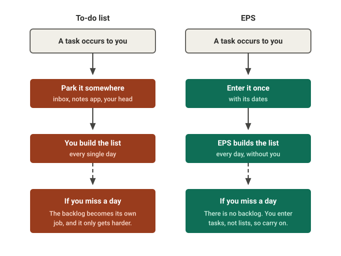
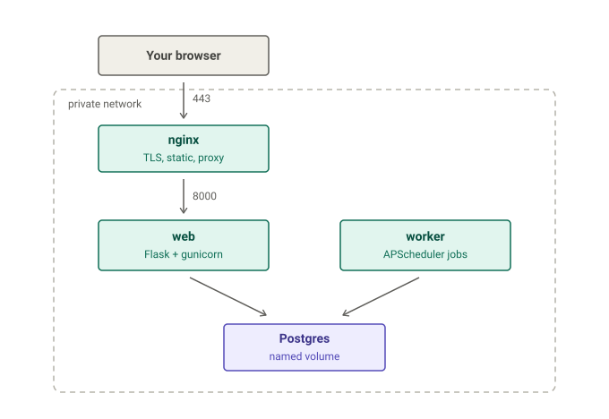
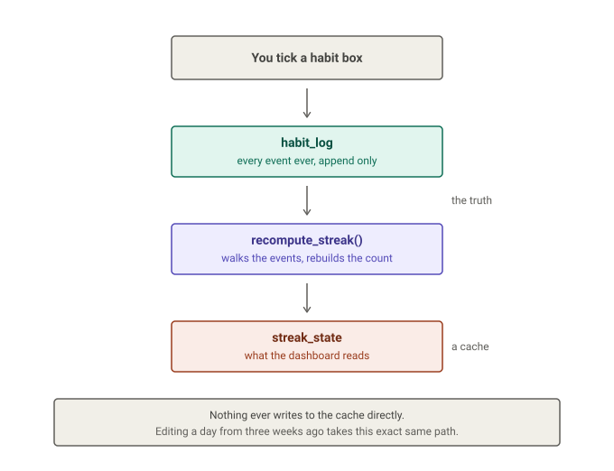
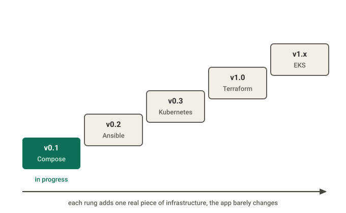
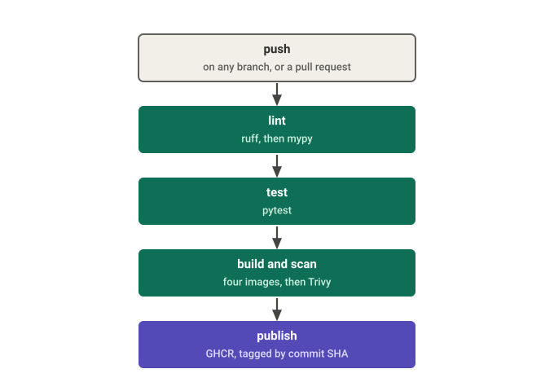

<a id="top"></a>

# EPS

**A productivity webapp that assembles your day for you, built one piece of infrastructure at a time.**

[](https://www.repostatus.org/#wip)
[](LICENSE)

Python, Flask, HTMX, Postgres, Docker Compose, and, one version at a time, Ansible, Kubernetes, Terraform and AWS.

> **Status: v0.1 in progress.** The design is finished and locked. The build started in July 2026 and the first tagged version is not out yet. This README describes what EPS is and where it is going, and it marks clearly what exists today versus what is scheduled.

### Quick links

[Why this exists](#why-this-exists) · [What it does](#what-it-does) · [How it is built](#how-it-is-built) · [How the data works](#how-the-data-works) · [The ladder](#the-ladder) · [Scope and non-goals](#scope-and-non-goals) · [Running it](#running-it) · [Design decisions](docs/decisions.md)

---

## Why this exists

I have gone through an insane amount of productivity applications, systems and methods in my attempts to increase the amount of work I could get done. Some have succeeded far more than others but they all shared the same fly in the ointment, in that the systems themselves require daily maintenance work in order for them to function.

That maintenance is the whole problem. With an ordinary to-do list, a task occurs to you, you park it somewhere so you do not lose it, and then at some point you have to sit down and turn that pile into tomorrow's list. That sorting job lands on you every single day. Miss it once, because you were busy or tired or you simply forgot, and the backlog becomes its own separate job to dig out of. The longer it sits the harder it is to start again, and that is usually the point where a system quietly dies.

EPS moves that job into the software. You enter a task once, with whatever dates it carries, and the system assembles each day for you.

<picture>
  <source media="(prefers-color-scheme: dark)" srcset="docs/img/failure-mode-dark.svg">
  
</picture>

The core idea is that you concentrate your effort on adding the important things you need to do while leaving all the maintenance work to the application itself. Habits, trackers, tasks, daily metrics. You set them up once and they are handled from then on. Less time spent deciding and more time spent doing.

The current version of this system runs on Claude Cowork by Anthropic. I have essentially been using an AI to organise my days. That has worked, but a lot of it is machinery that could just be implemented programmatically, either directly or with a few tweaks. This project is my attempt to build that.

One honest note about what this repository is. It is a learning project more than it is a product. I am using it as a substrate to practise for a career in DevOps and cloud engineering, which is why the version ladder below is built the way it is: each tag adds a real piece of infrastructure rather than shipping features.

<div align="right"><a href="#top">back to top</a></div>

---

## What it does

Everything below is single-user. The UI is server-rendered, so there is no separate frontend application.

**Streaks** are for forming good habits or minimising bad ones. You define something you want to keep up, like sleeping on time or practising a skill or drinking less coffee, and try to hold the streak. There is a grace mechanic: reach 7 days and you earn one free miss, which replenishes after another 7 days. That exists for things like staying under a calorie target, where you might splurge occasionally without wanting to wipe out a month of progress. It can be turned off.

**Trackers** are days-since-last-done counters for recurring things. Doing the dishes, grocery shopping, working out. You set a threshold and the tracker stays quiet until that many days have passed, at which point it surfaces on your list. Trackers can also be pinned to specific weekdays, so a weekly report only appears on Fridays.

**Tasks** are the main gimmick. Unlike an ordinary to-do list, every task carries date information. A deadline, meaning when it must be done by. A scheduled date, for something you intend to do on a particular day. Or a remind-after date, which keeps the task hidden until then. Quick-add defaults the date to today. Recurring things are not tasks, they are trackers, so tasks are one-shot: you do them, mark them done, and they are gone.

Tasks route into one of two dashboard sections. Priorities pulls in anything vital, due today or tomorrow, or already overdue. Scheduled pulls in what you planned for today plus deadlines three to five days out. Overdue tasks get a maintenance menu inline where they appear, so you never have to dig into a settings page to resolve them. Anything untouched for over a week resurfaces and asks whether you still intend to do it, which is what stops the list silently clogging up.

<details>
<summary>The rest of the components</summary>

<br>

**Daily metrics** are user-defined per-day numbers in two shapes: a 1 to 5 scale for subjective ratings, or a plain number with an optional unit. Rather than hardcoding sleep and weight and mood, the app lets you define whichever ones you care about.

**Daily state** holds per-day flags. Right now there is one, `bad_day`. Marking a day bad means the habit boxes you did not tick stop counting as failures, which protects streaks through rough patches without making you backfill anything.

**Daily notes** are a freeform text field per day. Nothing parses it. It is a journal for your future self.

**Calendar integration** pulls the coming week from Google Calendar, cached daily, read-only. The app never writes to your calendar. Events appear in the Scheduled section with a marker.

**Weather integration** pulls a daily forecast from BrightSky, which is free, unauthenticated and built on DWD data. A small rule-based engine turns the raw numbers into one practical line: rain probability over 50% suggests an umbrella, over 25°C suggests staying hydrated, and so on. The rules are plain code. There is no AI generating prose here.

**Settings** is a single-row table of global preferences: timezone, the fetch times for calendar and weather, and the coordinates used for the forecast.

**The audit log** records every change to event-shaped data: the timestamp, the table, the row, the field, the old value and the new one. Retention is 180 days with a nightly cleanup. Journal text is exempt, being high-churn and low value for debugging. v0.1 does not surface it in the UI. It is there for debugging now and as the foundation for an edit-history feature later.

</details>

<div align="right"><a href="#top">back to top</a></div>

---

## How it is built

EPS runs as four containers, each with one job.

<picture>
  <source media="(prefers-color-scheme: dark)" srcset="docs/img/topology-dark.svg">
  
</picture>

- **nginx** is the front door and the only container reachable from the outside. It holds the TLS certificates, serves the static files, and passes everything else inward.
- **web** is the application itself: Flask running under gunicorn, with every page rendered on the server through Jinja2 templates. The interactive touches come from HTMX, so there is no separate frontend application to maintain.
- **worker** is where the scheduled jobs will run (calendar fetch, weather fetch, stale-task flagging, audit cleanup, token refresh), in its own process rather than inside a web request. Nothing connects to it; it only reaches out. Today it is a heartbeat process, the jobs land later in v0.1.
- **Postgres** holds the data, accessed through SQLAlchemy, with every schema change applied as a versioned Alembic migration. Its files live on a named volume, so the data outlives the container.

All four sit on a private network, and the only published port is nginx's. The why behind these picks, Flask over FastAPI, HTMX over a separate frontend, four containers rather than one or fifteen, lives in [the decisions notebook](docs/decisions.md).

<div align="right"><a href="#top">back to top</a></div>

---

## How the data works

Every number EPS shows you, like a streak counter, is calculated from a permanent history rather than stored as the one true value.

Concretely: when you tick a habit checkbox, the app writes one small row into a log table saying this habit was done on this date. That log only ever grows; nothing in it gets overwritten. The streak count you see is then rebuilt by replaying the log from the start, and the rebuilt number lands in a summary table, which is what the dashboard actually reads.

<picture>
  <source media="(prefers-color-scheme: dark)" srcset="docs/img/model-c-dark.svg">
  
</picture>

The reason for the two-step setup is editing the past. Open a day from three weeks ago, tick a box you forgot, and the app does exactly what it always does: write the row, rebuild the summary. Every day since your edit comes out right on its own, there is no separate edit-the-past feature, and the summary can never disagree with the history, because it is thrown away and recalculated on every change.

More on why it is built this way, and what it was weighed against, in [the decisions notebook](docs/decisions.md).

<div align="right"><a href="#top">back to top</a></div>

---

## The ladder

Each version adds one real piece of infrastructure. The application barely changes across them, and that is on purpose. A small app deployed really well is the point, not a big app deployed badly.

<picture>
  <source media="(prefers-color-scheme: dark)" srcset="docs/img/ladder-dark.svg">
  
</picture>

| Version | What it adds | What it is there to prove | Status |
| --- | --- | --- | --- |
| **v0.1** | The four containers under Compose. Multi-stage non-root Dockerfiles, pinned bases, a private network, healthchecks, a named Postgres volume. Alembic from the first commit. CI: ruff, mypy, pytest, build, gitleaks and Trivy. Images to GHCR by commit SHA. | That the application is actually built, containerised properly and tested, and that the security and observability threads start at the beginning rather than getting bolted on. | In progress |
| **v0.2** | Ansible provisions a cheap VM, installs Docker, brings the Compose stack up, with secrets in Ansible Vault. | Configuration management, and it produces the first URL anyone can actually visit, months before there is a Kubernetes or AWS bill. | Planned |
| **v0.3** | The Compose stack becomes Helm charts on a local kind cluster. NetworkPolicies, the worker's jobs as CronJobs, probes, resource limits, an HPA, ingress-nginx and cert-manager, a k6 load test that trips the autoscaler, and a local Prometheus and Grafana. | Kubernetes, built and broken locally for free. Raw manifests first to learn the primitives, then Helm to template them. | Planned |
| **v1.0** | AWS through Terraform. A hand-rolled VPC with custom CIDR, public and private subnets across two AZs, IGW, NAT, route tables, security groups and NACLs. RDS, IAM, remote state on S3 with DynamoDB locking. CD through GitHub Actions authenticating by OIDC. tfsec or Checkov on the Terraform, Budgets and Infracost on the bill. | Infrastructure as code against a real cloud. The VPC is hand-rolled rather than taking the default-VPC shortcut, because the default VPC hides exactly the parts I am trying to learn. | Planned |
| **v1.x** | The same Helm charts onto EKS behind an ALB. IRSA for keyless AWS access, Secrets Manager through the External Secrets Operator, Prometheus, Grafana, Alertmanager and Loki, deploys moved to ArgoCD, Pod Security Admission on top. | The capstone. Managed Kubernetes with the security and observability stories finished rather than sketched. | Planned |

### The three threads

CI/CD, security and observability are not single rungs. They are threads that get thicker at every version.

| Thread | v0.1 | v0.3 local k8s | v1.0 AWS | v1.x EKS |
| --- | --- | --- | --- | --- |
| **CI/CD** | lint, test, build, scan | charts tested in CI | push-based deploy plus smoke tests | GitOps with ArgoCD |
| **Security** | gitleaks, `.env` hygiene, Trivy | NetworkPolicies, K8s secrets | tfsec, least-privilege IAM, Secrets Manager | IRSA, External Secrets, Pod Security Admission |
| **Observability** | JSON logs, `/metrics`, `/healthz`, `/readyz` | Prometheus and Grafana on kind | CloudWatch for the AWS pieces | Prometheus, Grafana, Alertmanager, Loki |

v0.2 mostly inherits the v0.1 threads with Ansible Vault added. One prerequisite is worth calling out: the structured logging and the `/metrics` endpoint go into the application back at v0.1, even though no dashboard or alert consumes them until much later. Logs you can query later only exist if the app emits them properly from the start.

### Secrets

The rule is the same the whole way up: code in git, secret values never. Raw Kubernetes Secrets do not count as secure on their own, since base64 is encoding and not encryption, so a value never gets written into a manifest. It gets pulled from somewhere encrypted.

v0.1 uses a gitignored `.env` read through a single settings object, with `.env.example` committed so the required shape is documented, and gitleaks in the pre-commit hook so nothing leaks by accident. v0.2 moves to Ansible Vault. v0.3 uses a plain Kubernetes Secret and says so openly in a decision record as the known-weak version that gets replaced later, because the upgrade is part of the story. v1.0 moves to AWS Secrets Manager with KMS. v1.x pulls from Secrets Manager into the cluster through the External Secrets Operator, authenticated by IRSA.

<div align="right"><a href="#top">back to top</a></div>

---

## Scope and non-goals

This is optimised for learning, which means it deliberately takes the long route in places where a shortcut existed. It should not be read as production-ready software, and it is not trying to be a product you would adopt.

Things deliberately left out, and why:

- **No systemd-on-bare-metal rung and no multi-distro Bash bootstrap.** A container does not care what host it runs on, so scripting a hand-installed VM spends effort proving a problem containers already solved.
- **No Terraform against a local VM.** Using Terraform to spin up a libvirt box just to run Docker on it teaches nothing that the AWS rung does not teach better. Terraform shows up where it is load-bearing.
- **No Kustomize.** Helm covers the templating. Authoring both for a four-tier app is padding.
- **No service mesh.** Istio on a single-user four-tier application is textbook over-engineering.
- **No blue-green or canary deploys.** There is no traffic to canary. The rolling-update default plus one paragraph of reasoning answers the question honestly.
- **No distributed tracing and no separate status page.** Tracing a mostly-synchronous single-user request path is a great deal of work for almost nothing, and a Grafana panel covers the other.
- **No LLM anywhere in the application.** A structured input UI replaces fuzzy parsing. The irony of that, given where this system currently lives, is not lost on me.

Single-user throughout. Multi-user is not a v1 concern and the settings table has a constraint enforcing exactly one row.

<div align="right"><a href="#top">back to top</a></div>

---

## Running it

**This does not work yet.** v0.1 is being built. When it lands, the whole procedure is meant to be this, and if it is not then v0.1 is not done:

```bash
git clone https://github.com/omniops-mm/eps-cloud.git
cd eps-cloud
cp .env.example .env      # then fill in the values it asks for
docker compose up
```

That is the v0.1 done-line, stated as user documentation on purpose so there is no room to move the goalposts later. Google Calendar OAuth may slip to v0.1.1, in which case the app comes up fine without it and shows the integration as not configured.

<div align="right"><a href="#top">back to top</a></div>

---

## Continuous integration

Every push and every pull request runs linting (ruff), type checking (mypy) and the test suite. A red build blocks the merge. The image build, the Trivy scan and the push to the registry are the next things to land in this pipeline; the diagram below shows the finished shape.

<picture>
  <source media="(prefers-color-scheme: dark)" srcset="docs/img/ci-dark.svg">
  
</picture>

Two details worth pointing out. Images are tagged by commit SHA rather than `latest`, so any running container can be traced back to the exact source that produced it. And dependencies are locked, not floated, so a build in November installs exactly what a build in July installed. A vulnerability scan only means something when you know precisely what is inside the image.

<div align="right"><a href="#top">back to top</a></div>

---

## Repository layout

One application, deployed progressively more seriously. The directories below arrive with the version that needs them, rather than sitting empty from the start.

```
app/          the Flask application: routes, templates, models, recompute
worker/       the scheduler and its five jobs
alembic/      migrations, from the first commit
tests/        pytest suite
docs/         decisions, diagrams
compose.yml   v0.1 lives here
deploy/       ansible (v0.2), helm (v0.3), terraform (v1.0), added as they arrive
```

There is no second copy of the application per version. The point of this project is that the app stays still while the infrastructure around it gets serious, and five forked copies of `app/` would contradict that. Version history lives in git tags and releases.

<div align="right"><a href="#top">back to top</a></div>

---

## Design decisions

Notes on each real decision, what it was weighed against and what it costs, are in **[docs/decisions.md](docs/decisions.md)**. It is more of a notebook than official documentation. A plain list of technologies would not say much on its own; the reasoning is the interesting part, and writing it down is how I keep hold of it months later.

---

## License

MIT, see [LICENSE](LICENSE).

<div align="right"><a href="#top">back to top</a></div>
